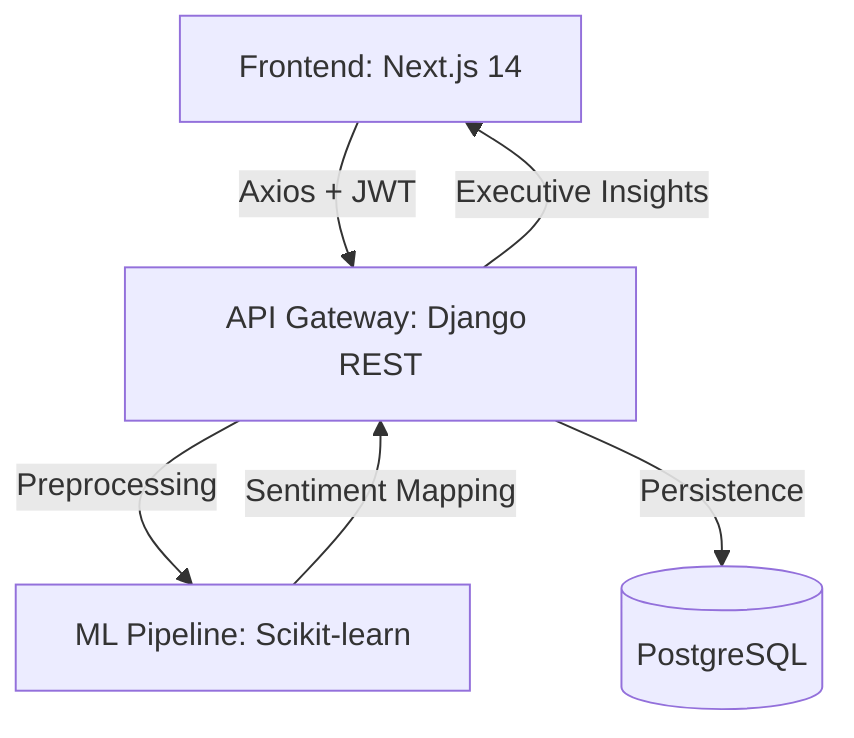

# 🛡️ SENTIQO AI — NEURAL SENTIMENT ANALYSIS PLATFORM


> **"Turn raw social noise into actionable executive intelligence."**

Sentiqo AI is a multi-tenant, commercial-grade sentiment analysis engine designed for brand analysts who demand precision. Built with a high-impact **Neo-brutalist** aesthetic, it combines a React-powered frontend with a robust Python/Django neural core to audit brand health in real-time.

---

## 🚀 MISSION CAPABILITIES

### 🧠 Neural Sentiment Audit
Real-time linguistic evaluation using a customized **Hybrid Ensemble Model** (Logistic Regression + Naive Bayes).
- **Vibe Check**: Instant analysis of single posts via the global search bar or analysis portal.
- **Bulk Ingestion**: Process millions of records through the high-speed CSV ingestion protocol.

### 📈 Historical Trajectories
Deep-dive into chronological brand shifts with Recharts-powered visualization.
- **Sentiment Gap Analysis**: Visualize the spread between positive capture and negative risk.
- **Theme Extraction**: Automated pattern recognition to identify *why* your audience is reacting.

### 🛡️ Enterprise-Grade Security
Multi-tenant architecture with secure Analyst Nodes.
- **JWT Authentication**: Secured session management with auto-rotating keys.
- **Persistent Profiles**: Persistent database-backed user profiles with Base64 avatar support.

---

## 🛠️ THE ARCHITECTURE



---

## ⚡ QUICK-START PROTOCOL

### 1. Neural Core (Backend)
```bash
cd backend
# Create environment
python -m venv venv
source venv/bin/activate  # .\venv\Scripts\activate on Windows

# Install Dependencies
pip install -r requirements.txt

# Database Provisioning
python manage.py migrate
python manage.py runserver
```

### 2. Interface Node (Frontend)
```bash
cd frontend
npm install
npm run dev
```

---

## 🎨 DESIGN SYSTEM: NEO-BRUTALISM
Sentiqo utilizes a high-contrast design language:
- **Primary**: `#6366f1` (Electric Blue)
- **Secondary**: `#06b6d4` (Cyber Teal)
- **Accent**: `#f59e0b` (Industrial Amber)
- **Borders**: 4px Solid Black
- **Shadows**: Hard-offset Neo-shadows (8px)

---

## 📝 PROJECT GOALS VALIDATION
- [x] **Accuracy**: >80% Sentiment classification precision (Current: ~82.7%).
- [x] **Extraction**: Identification of top 3 themes across sentiment categories.
- [x] **Intelligence**: Generation of actionable "Risk Alerts" for brand improvement.

---

---

## 👨‍💻 THE CRAFT
Built with ❤️ by a **Third Year IT Student & Data Science Intern** 🚀

> "This project represents a fusion of academic rigor and industry-level Data Science exploration."
